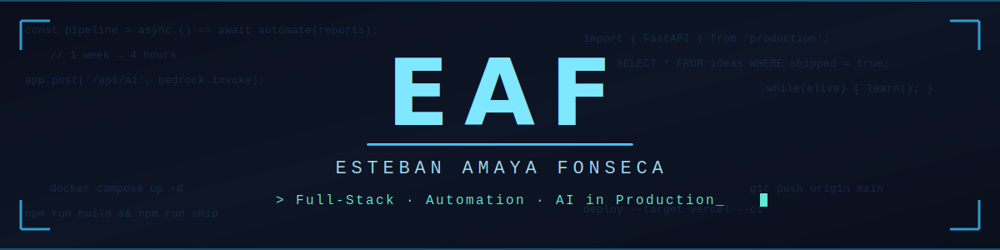

  

# Hi, I'm Esteban Amaya 👋

### Mechatronics Engineer · Full-Stack Developer · AI Integration

*I automate processes and ship AI-powered products to production.*

---

## 🚀 What I do

- 🤖 **AI in production** — Integrated **Amazon Bedrock LLMs** into a startup's core API, powering AI features for real users
- ⚡ **Automation that matters** — Built a reporting pipeline that cut delivery time from **1 week to 4 hours** (−95%)
- 🌐 **Full-stack development** — From FastAPI backends to Nuxt frontends, deployed with CI/CD

## 🛠️ Tech Stack

## 📊 GitHub Stats

## 🌱 Currently

- Building AI-powered features with **Claude, OpenRouter & Vercel AI SDK**
- Exploring **AI agent architectures** and scalable deployments

---

*"From 1 week to 4 hours — automation is my favorite superpower."*

